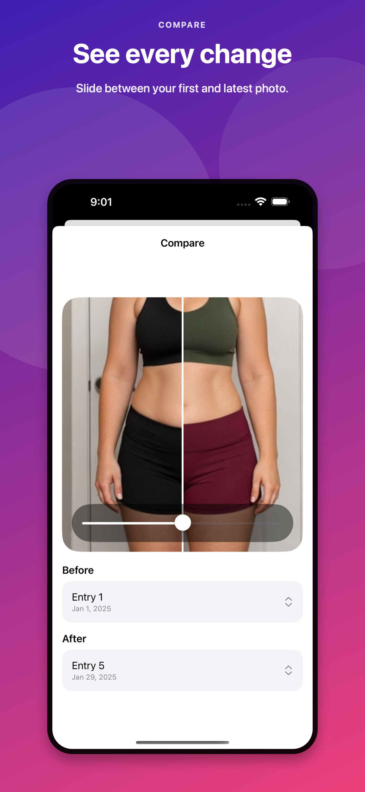
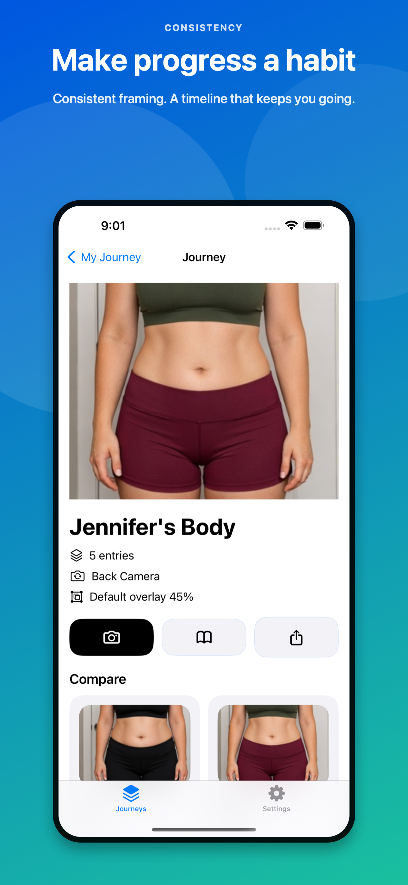
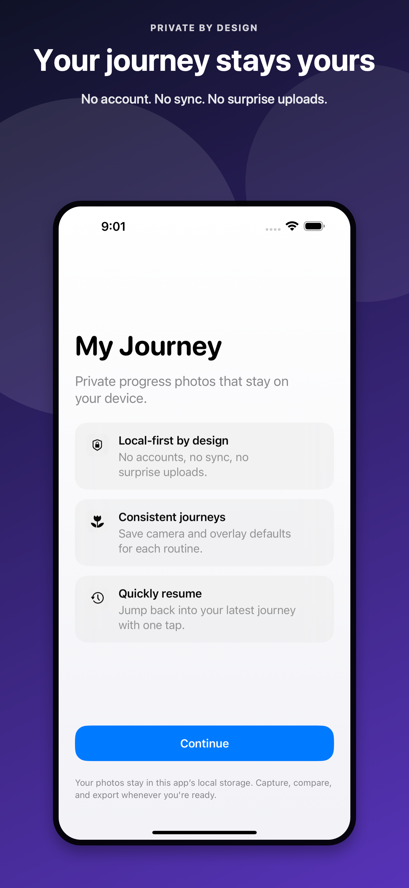

# My Journey

My Journey is a privacy-first progress photo app for iPhone and iPad. It helps you capture consistent photos over time, line up each new shot with your previous one, compare progress, and export shareable GIFs or MP4s without sending your images to an account, cloud service, or remote processor.

The planned App Store listing name is `My Journey - Progress through pics`.

<p align="center">
  
  
  
</p>

## Help Build It, Get Premium

My Journey is open source, and real contributions are genuinely appreciated.

If you fix a confirmed issue or submit a pull request that improves the app and gets merged, you will receive a code for the Premium in-app purchase. Premium currently unlocks the Remove Watermark entitlement for exports.

Good contributions include bug fixes, accessibility improvements, test coverage, UI polish, privacy or security hardening, documentation, release polish, and thoughtful feature improvements. If you are unsure where to start, check the open issues or open a small proposal before building.

Codes are provided after the contribution is accepted or merged. Availability follows App Store promotional or offer code rules.

## Features

- Progress-photo journeys for anything you want to document over time.
- Live camera capture with latest-photo overlay for consistent alignment.
- Adjustable overlay opacity, grid, and timer controls.
- Local journey metadata, images, and thumbnails.
- Journey detail timeline with first/latest summaries.
- Before/after comparison view.
- GIF and MP4 export with the iOS share sheet.
- Optional date and entry number overlays for exports.
- Free GIF watermark behavior with StoreKit-backed Premium entitlement.
- Local reminders for keeping a photo habit.
- Settings, privacy, and about screens.

## Privacy

My Journey is designed around local-first storage for personal progress photos.

- No account is required.
- Journey images and metadata are stored locally on device.
- Export rendering happens in app.
- Exported files are written locally and handed directly to the iOS share sheet.
- No cloud upload, account sync, or remote processing is involved in the export path.

## Running Locally

Requirements:

- Xcode with the iOS SDK installed.
- An iPhone or iPad simulator for general development.
- A physical device for final camera behavior testing.

Steps:

1. Clone the repository.
2. Open `MyJourney.xcodeproj` in Xcode.
3. Select the `MyJourney` scheme.
4. Run on an iPhone or iPad simulator, or on a physical device for camera testing.
5. Use `MyJourney/Products.storekit` when testing the Premium purchase flow locally.

## Project Structure

```text
MyJourney/
  App/             SwiftUI app entry point and dependency container
  Models/          Journeys, entries, export options, settings, entitlements
  Persistence/     Local JSON stores for journeys, settings, and metadata
  Services/        Camera, images, export, monetization, reminders
  ViewModels/      Screen state and user actions
  Views/           SwiftUI screens and reusable UI pieces
```

## Areas Where Help Is Welcome

- App Store release hardening and review-readiness checks.
- Real-device camera testing and permission edge cases.
- Accessibility passes for VoiceOver, Dynamic Type, labels, and contrast.
- Export reliability and performance for larger journeys.
- Custom export range selection.
- Background or resumable exports.
- Privacy review, documentation, and release notes.
- Focused unit/UI test coverage.

See [CONTRIBUTING.md](CONTRIBUTING.md) for how to help and how contributor Premium codes work.

## Current Limitations

- MP4 exports are silent video only.
- Exports currently use the full journey timeline rather than a custom subset picker.
- Real camera behavior still needs physical device testing; simulator builds verify compile and integration behavior only.
- Export rendering happens in app and is not yet background-resumable for very large journeys.

## Screenshots

Upload-ready marketing images are stored in `AppStoreScreenshots/final` for both iPhone and iPad. The raw simulator captures and screenshot generation script are also included for release iteration.

## License

A license file should be added before wider release so contributors and users know exactly how the code can be used.
